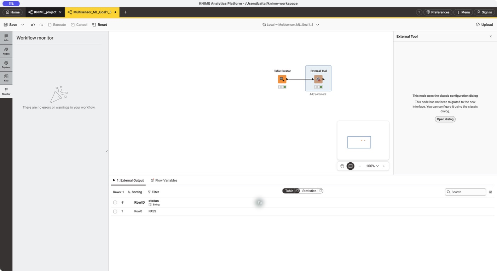
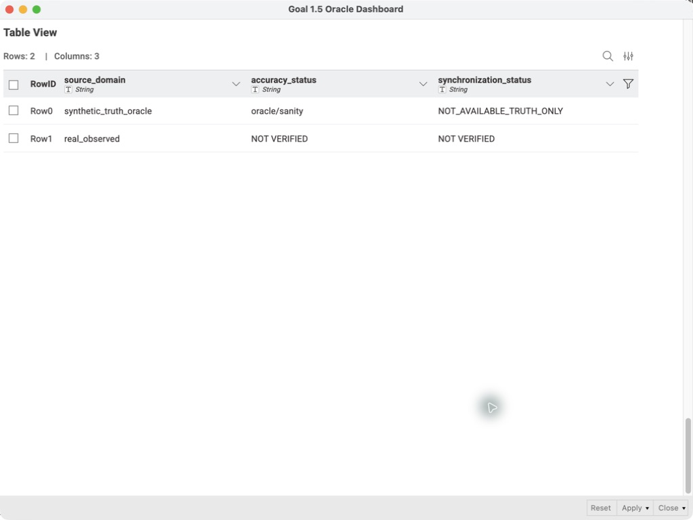

# KNIME 5.12 사용법

## 역할 분리

Python은 생성 참조, prepare, 학습, 평가, 안전한 bundle을 담당한다.
KNIME은 `scripts/knime_run_goal15.sh`를 External Tool로 실행하고 결과
Parquet/JSON을 읽어 시각화한다. 학습 코드를 KNIME 노드 안에 복제하지 않는다.

## 워크플로 입력

- ML project path: `/Users/baital/dev/multisensor_ml`
- experiment config:
  - quick: `configs/goal15_quick.yaml`
  - full: `configs/goal15_mvp3.yaml`
- run mode: `run-all`, `materialize-synthetic`, `train`
- optional status output: KNIME External Tool 확인용 CSV 경로

스크립트는 프로젝트 `.venv`와 동일한 `uv.lock`을 `--frozen`으로 사용한다.
배포한 워크플로의 External Tool은 네 번째 인수로
`/private/tmp/knime_goal15_output.csv`를 전달하며, 성공하면 `PASS` 한 행을
출력한다.

## 실행 순서

1. [Multisensor_ML_Goal1_5.knwf](../knime/Multisensor_ML_Goal1_5.knwf)를
   KNIME Local space에 import한다.
2. `Goal 1.5 Oracle Dashboard` 컴포넌트를 열고 Table Creator의 project,
   config, mode 값을 확인한다.
3. full 결과가 이미 있다면 재학습하지 말고 Parquet Reader 이후 노드만
   실행한다.
4. 새 실험을 실행할 때만 External Tool을 포함해 **Execute all** 한다.
5. 실행이 끝나면 컴포넌트를 선택하고 **Open in new window**로 Composite
   View를 연다.

## 다섯 화면

1. Dataset & Split: run/person/split과 24/6/6 확인
2. Personal Baseline: `personal_weight`, `n_eff`, factor center/MAD 안정화
3. Pattern Performance: probability/phase timeline, PR curve, confusion matrix,
   AUCPR, event recall, false alerts/hour, lead time
4. Noise Stress: scenario별 AUCPR·Brier·ECE·event recall·오경보·degradation
5. Synchronization & Real Audit: oracle와 real 상태를 별도 표시

`real_observed` 행의 accuracy/synchronization이 `NOT VERIFIED`가 아닌 경우는
Goal 1.5 결과로 받아들이면 안 된다.

Composite View는 위 다섯 화면을 6개 표로 구성한다. 마지막
Synchronization & Real Audit 화면은 synchronization 표와 real-status 표를
분리해 읽는다.

## 설치·검증 상태

2026-07-27 KNIME 5.12.0에서 다음 공식 확장을 설치하고 재시작했다.

- KNIME Extension for Big Data File Formats 5.12.0
- KNIME External Tool Support 5.12.0

워크플로 원본을 실행한 뒤 `.knwf`로 export했고, 별도 Local space 폴더
`Goal1_5_Readback_2`에 다시 import하여 Execute all과 Composite View
readback을 완료했다. 재가져온 화면에서도 synthetic truth는 `oracle/sanity`,
real observed는 정확도와 동기화 모두 `NOT VERIFIED`로 표시됐다.

## 확장 문제 해결

Parquet Reader가 보이지 않으면 KNIME 공식
**Extension for Big Data File Formats**를 설치하고 KNIME을 재시작한다.
External Tool이 보이지 않으면 **KNIME External Tool Support**를 설치하고
재시작한다.
기존 `/Users/baital/knime-workspace/KNIME_project`는 변경하지 않는다.
