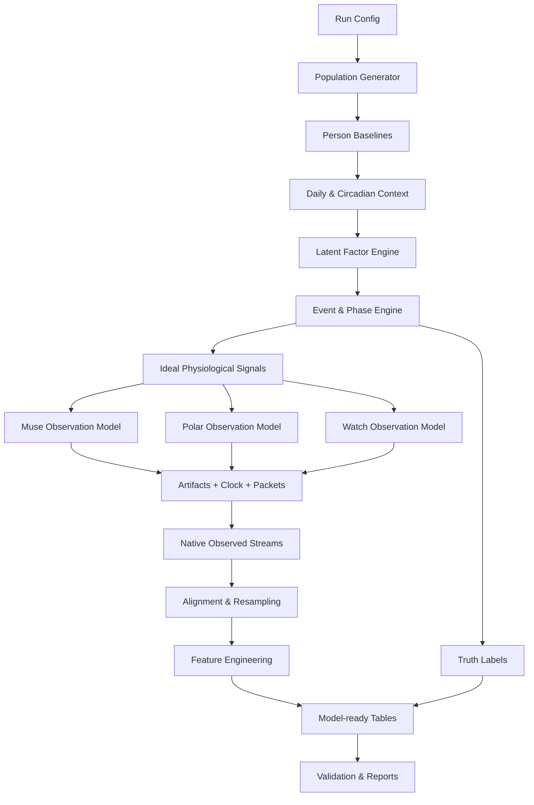

# 기술 아키텍처 설계서

## 1. 설계 목표

다음 조건을 동시에 만족하는 독립형 합성데이터 생성기를 만든다.

- 여러 사람의 5일 데이터가 동일한 절대 타임라인을 공유한다.
- 사람마다 서로 다른 기준선과 반응 순서를 가진다.
- EEG, ECG/RR/HRV, EDA, PPG, 세 위치의 움직임이 서로 연결된다.
- 연결은 완벽하지 않으며 지연, 무반응, 반대 반응이 존재한다.
- 장비 native rate, 패킷화, 시계 오차, 결측, 아티팩트를 재현한다.
- 파생변수와 라벨을 재현 가능하게 생성한다.
- 앱·실기기 SDK 없이 로컬에서 실행한다.
- 향후 실제 데이터 통계로 파라미터만 교정할 수 있다.

---

# 2. 전체 구조



핵심은 `Event & Phase Engine`이 신호와 라벨의 공동 원인이 되지만, 모델 입력에는 그 숨겨진 상태를 직접 넣지 않는 것이다.

---

# 3. 3계층 데이터 모델

## 3.1 `truth`

시뮬레이션이 실제로 주입한 정답이다.

- `person_profile_truth`
- `latent_factor_timeline`
- `event_manifest_truth`
- `ideal_signal_state`
- `artifact_manifest_truth`
- `clock_model_truth`

용도:

- 라벨 생성
- 생성 정확성 검증
- 아티팩트 탐지 평가
- 디버깅

일반적인 패턴 분류 모델 입력에는 포함하지 않는다.

## 3.2 `observed`

장비가 측정한 것처럼 보이는 신호다.

- 장비별 native sample rate
- 장비별 `device_time_ns`
- 패킷 지연과 순서
- 센서 잡음과 접촉 불량
- 결측 블록
- saturation/clipping

## 3.3 `model_ready`

후속 모델이 바로 사용할 수 있는 정렬 데이터다.

- 1 Hz canonical timeline
- 다중 윈도 파생변수
- 개인 기준선 이탈 피처
- 품질·결측 피처
- 사건 단계와 미래 예측 라벨
- 사람 단위 split manifest

---

# 4. 2계층 생성 전략

## Tier A — 전체 기간 정렬 타임라인

참여자마다 5일 전체를 1초 간격으로 생성한다.

```text
5 days × 86,400 seconds/day = 432,000 rows/person
12 persons = 5,184,000 canonical rows
```

Tier A에는 다음이 들어간다.

- 1초 요약 관측값
- 각 센서의 품질·결측률
- 다중 윈도 파생변수
- 라벨

## Tier B — native-rate waveform clips

다음 구간에 대해서만 장비 원래 샘플링률의 파형을 생성한다.

- 모든 target event: 기본 `-300 s ~ +600 s`
- 같은 시간대의 matched baseline clip
- hard negative event
- artifact-only event
- 선택적 calibration clip

이유:

- 5일 전체 3장비 원시 파형은 참여자 수가 늘면 수십 GB 이상이 된다.
- 향후 앱은 주로 파생변수와 연속 패턴을 사용한다.
- 사건 주변 원시 파형만 있어도 feature extractor와 품질 로직을 검증할 수 있다.

`full_raw` 설정은 별도로 제공하되 기본 실행에는 포함하지 않는다.

---

# 5. 계층적 생성 모델

## 5.1 Population prior

연령대·수면 유형·활동 수준·생리적 변동성 등 넓은 prior를 정의한다.

```text
population distribution
├── baseline cardiac profile
├── baseline EEG spectral profile
├── baseline EDA profile
├── motion style
├── circadian amplitude
├── sensor tolerance/contact tendency
└── response archetype probabilities
```

ASD 관련 논문은 이 단계의 일부 분포를 약하게 조정할 수 있으나 특정 개인이나 사건을 결정하지 않는다.

## 5.2 Person baseline

각 참여자는 한 번 샘플링한 개인 파라미터를 5일 동안 유지한다.

예:

- resting HR, RMSSD, RR variability
- EEG band-power ratio와 1/f exponent
- tonic EDA 수준과 SCR 빈도
- 자극 반응 민감도
- 회복 속도
- 움직임 반복성
- 센서 접촉 불량 경향
- 장비별 clock drift

상관된 파라미터는 독립 난수가 아니라 다변량 분포 또는 계층적 조건부 규칙으로 생성한다.

## 5.3 Day/session drift

날짜마다 기준선이 조금 달라진다.

- 수면 부족
- 활동량
- 누적 피로
- 기상 시간
- 센서 장착 품질
- 회복력
- 기기 배터리·전송 안정성

`person baseline`을 파괴하지 않는 범위에서 drift를 적용한다.

## 5.4 Latent factor engine

하나의 배타적 상태만 두지 않고 연속 잠재요인을 동시에 사용한다.

| 잠재요인 | 범위 | 주요 관측 영향 |
|---|---:|---|
| `autonomic_arousal` | 0~1 | HR, HRV, EDA, PPG |
| `motor_activation` | 0~1 | 세 장비 ACC, PPG/EEG artifact |
| `cognitive_load` | 0~1 | EEG band·entropy, 약한 자율 변화 |
| `sleep_pressure` | 0~1 | EEG, 움직임, 심박, 일중 변화 |
| `sensory_context` | 0~1 | 사건 발생 확률의 문맥 변수 |
| `recovery_capacity` | 0~1 | event decay와 baseline 복귀 |
| `social_context` | 0~1 | 연구 시나리오용 선택 문맥, 직접 라벨 아님 |

잠재요인은 상관된 확률과정으로 생성한다. 예를 들어 VAR, Ornstein–Uhlenbeck, 상태공간 모델 또는 스플라인 기반의 느린 추세를 사용할 수 있다.

---

# 6. 일상 상태와 사건 엔진

## 6.1 일상 상태

- `sleep`
- `wake_rest`
- `sedentary_activity`
- `light_activity`
- `moderate_activity`
- `focused_task`
- `meal_context`
- `transition`

일상 상태는 사건과 별개로 모든 신호를 변화시킨다. 정상 데이터가 평평하지 않도록 한다.

## 6.2 사건 단계

```text
baseline
→ pre_early
→ pre_late
→ onset
→ peak
→ recovery_early
→ recovery_late
→ post
```

각 단계는 고정 길이가 아니라 분포에서 샘플링한다.

| 단계 | 기본 범위 | 의미 |
|---|---:|---|
| `pre_early` | 60~180초 | 완만한 일부 축의 변화 |
| `pre_late` | 15~60초 | onset 직전 변화 강화 |
| `onset` | 5~30초 | 상승 시작 |
| `peak` | 10~120초 | 최대 반응 구간 |
| `recovery_early` | 30~180초 | 빠른 초기 복귀 |
| `recovery_late` | 60~600초 | 느린 잔여 효과 |
| `post` | 0~600초 | 선택적 피로·억제 구간 |

범위는 설정으로 조정한다. 모든 사건이 모든 단계를 갖지 않는다.

## 6.3 반응 archetype

| 유형 | 예시 순서 |
|---|---|
| `eeg_first` | EEG → EDA/HRV → 움직임 |
| `autonomic_first` | EDA/HRV → EEG → 움직임 |
| `motor_first` | 움직임 → HR/EDA → EEG |
| `quiet_internal` | EEG/HRV 변화, 움직임 약함 |
| `motor_dominant` | 움직임 강함, 자율 반응 약함 |
| `partial_response` | 한두 축만 변화 |
| `non_responder` | target context가 있어도 관측 변화가 미약 |

한 사람은 주 archetype을 가지되 사건마다 변형한다.

---

# 7. 신호 생성 계층

## 7.1 이상적 생리 신호

아티팩트가 없는 상태에서 latent factor가 생리 신호를 만든다.

- EEG: aperiodic 1/f + oscillatory components + transient bursts
- ECG: beat timing → morphology → ECG waveform
- RR/HR: beat timing에서 도출
- PPG: ECG보다 뒤처진 pulse waveform
- EDA: tonic component + phasic SCR events
- 움직임: orientation + gravity + dynamic acceleration + repetitive component
- 온도: 느린 body/ambient/contact mixture

## 7.2 장비 관측 모델

각 장비는 같은 숨겨진 생리 상태를 다르게 관측한다.

```text
ideal physiology
→ sensor transfer function
→ device noise
→ placement/orientation
→ contact quality
→ quantization/clipping
→ sample clock
→ packet transport
```

예:

- H10 ECG의 R-peak는 명확하지만 움직임과 접촉에 의해 baseline wander가 생긴다.
- Watch PPG는 손목 움직임에 강하게 오염된다.
- Muse EEG는 눈 깜빡임·턱 근전도·전극 pop·접촉 저하에 영향을 받는다.
- Watch EDA는 1 Hz이므로 빠른 SCR 형태가 양자화된다.

---

# 8. 아티팩트 모델

## 8.1 EEG

- blink/EOG pulse
- jaw/facial EMG burst
- head-motion artifact
- electrode pop
- contact impedance drift
- channel dropout
- common-mode noise
- 50/60 Hz mains
- clipping/saturation
- flatline

## 8.2 ECG/RR

- baseline wander
- motion burst
- electrode contact loss
- missed R-peak
- extra R-peak
- ectopic-like beat for algorithm robustness
- packet gap

의학적 부정맥을 진단 데이터처럼 재현하는 것이 아니라 R-peak 처리 견고성을 시험하는 합성 교란으로 표시한다.

## 8.3 PPG

- motion-coupled artifact
- pulse amplitude modulation
- contact loss
- ambient light leakage
- saturation
- dropped blocks

## 8.4 EDA

- tonic drift
- sparse SCR
- movement spike
- contact loss
- dry-skin low response
- flatline
- 1 Hz quantization

## 8.5 IMU

- sensor bias
- scale error
- orientation rotation
- gravity leakage
- clipping
- timestamp jitter
- packet loss

각 아티팩트는 `artifact_manifest_truth`에 기록하고, 관측 데이터에는 결과만 반영한다.

---

# 9. 시간 동기화 모델

모든 샘플은 네 가지 시간을 가질 수 있다.

| 필드 | 의미 |
|---|---|
| `truth_time_ns` | 시뮬레이션의 절대 정답 시간 |
| `device_time_ns` | 장비 내부 시계 시간 |
| `receive_time_ns` | 수집기가 받았다고 가정한 시간 |
| `aligned_time_ns` | 동기화 알고리즘이 추정한 시간 |

장비별 모델:

```text
device_time = truth_time
            + initial_offset
            + drift_ppm × elapsed_time
            + short_term_jitter
```

전송 모델:

```text
receive_time = device_time
             + packetization_delay
             + BLE_latency
             + occasional_reordering
```

합성 결과는 `aligned_time_ns`를 제공하되, 정렬 오차도 남겨 후속 파이프라인을 시험한다.

---

# 10. 정렬과 리샘플링

## 원칙

- 원시 native stream을 먼저 생성한다.
- 공통 1초 그리드로 단순 보간하지 않고 신호 특성에 맞는 집계를 사용한다.
- 결측을 값 0으로 바꾸지 않는다.
- 각 집계에 `coverage_ratio`, `sample_count`, `quality_score`를 붙인다.

예:

| 신호 | 1초 집계 |
|---|---|
| EEG | band power·entropy·artifact 비율, 원시값 평균 아님 |
| ECG | R-peak 수, HR, RR 요약, 품질 |
| EDA | mean/min/max/slope, SCR 상태 |
| ACC | vector magnitude, ENMO, variance, jerk |
| PPG | pulse·품질 요약 |
| 온도 | 최근값·평균·slope |

---

# 11. 모듈 구조

```text
multisensor-synth/
├── pyproject.toml
├── README.md
├── LICENSE
├── configs/
│   ├── quick.yaml
│   ├── mvp.yaml
│   └── schemas/
├── src/multisensor_synth/
│   ├── cli.py
│   ├── config/
│   │   ├── models.py
│   │   ├── loader.py
│   │   └── validators.py
│   ├── domain/
│   │   ├── types.py
│   │   ├── units.py
│   │   └── contracts.py
│   ├── population/
│   │   ├── generator.py
│   │   ├── baselines.py
│   │   └── circadian.py
│   ├── latent/
│   │   ├── factors.py
│   │   ├── daily_context.py
│   │   └── state_process.py
│   ├── events/
│   │   ├── scheduler.py
│   │   ├── phases.py
│   │   ├── archetypes.py
│   │   └── hard_negatives.py
│   ├── signals/
│   │   ├── eeg.py
│   │   ├── ecg.py
│   │   ├── ppg.py
│   │   ├── eda.py
│   │   ├── motion.py
│   │   └── temperature.py
│   ├── devices/
│   │   ├── muse_s.py
│   │   ├── polar_h10.py
│   │   └── galaxy_watch8.py
│   ├── artifacts/
│   │   ├── eeg.py
│   │   ├── cardiac.py
│   │   ├── wrist.py
│   │   └── packet_loss.py
│   ├── timing/
│   │   ├── clocks.py
│   │   ├── transport.py
│   │   └── align.py
│   ├── features/
│   │   ├── eeg.py
│   │   ├── hrv.py
│   │   ├── eda.py
│   │   ├── motion.py
│   │   ├── cross_modal.py
│   │   └── baseline.py
│   ├── labels/
│   │   ├── phases.py
│   │   ├── forecasts.py
│   │   └── validity.py
│   ├── export/
│   │   ├── parquet.py
│   │   ├── mne_fif.py
│   │   └── manifest.py
│   ├── validation/
│   │   ├── schema.py
│   │   ├── invariants.py
│   │   ├── leakage.py
│   │   ├── statistics.py
│   │   └── report.py
│   └── orchestration/
│       ├── pipeline.py
│       └── chunks.py
└── tests/
    ├── unit/
    ├── integration/
    ├── property/
    └── golden/
```

---

# 12. 핵심 인터페이스

```python
from typing import Protocol

class SignalGenerator(Protocol):
    def generate(self, context: "SignalContext") -> "NativeSignalBatch": ...

class DeviceObservationModel(Protocol):
    def observe(
        self,
        ideal: "IdealSignalBatch",
        device: "DeviceContract",
        rng: "RandomGenerator",
    ) -> "NativeSignalBatch": ...

class FeatureExtractor(Protocol):
    def transform(
        self,
        streams: "AlignedStreams",
        windows: list[int],
    ) -> "FeatureTables": ...

class Validator(Protocol):
    def validate(self, run: "GeneratedRun") -> list["ValidationFinding"]: ...
```

모든 generator는 전역 난수를 사용하지 않고 주입받은 RNG를 사용한다.

---

# 13. 결정적 난수 구조

한 seed를 모든 모듈이 순서대로 소비하면 모듈 추가 시 결과가 전부 바뀐다. 이름 기반 child seed를 사용한다.

```text
run_seed
├── population
├── person/P001/baseline
├── person/P001/day/01
├── person/P001/event/E001
├── person/P001/device/muse
├── person/P001/device/polar
└── person/P001/device/watch
```

권장 구현:

- `numpy.random.SeedSequence`
- 안정적인 namespace hash
- manifest에 모든 child seed 기록

---

# 14. 출력 구조

```text
output/<run_id>/
├── manifest.json
├── config_snapshot/
├── truth/
│   ├── participants.parquet
│   ├── daily_context.parquet
│   ├── latent_timeline.parquet
│   ├── events.parquet
│   ├── artifacts.parquet
│   └── clock_models.parquet
├── observed/
│   └── native/<person_id>/<device>/<stream>/<clip_id>.parquet
├── model_ready/
│   ├── timeline_1hz.parquet
│   ├── features_5s.parquet
│   ├── features_30s.parquet
│   ├── features_60s.parquet
│   ├── features_180s.parquet
│   ├── features_300s.parquet
│   ├── labels.parquet
│   └── splits.parquet
├── clips/
│   ├── eeg_fif/
│   └── clip_manifest.parquet
├── reports/
│   ├── validation_report.json
│   ├── validation_report.html
│   └── summary_statistics.parquet
└── provenance/
    ├── dependencies.lock
    ├── licenses.csv
    └── sbom.json
```

---

# 15. 실행 인터페이스

```bash
# 빠른 개발 확인
uv run multisensor-synth generate --config configs/quick.yaml

# 12명 × 5일 MVP
uv run multisensor-synth generate --config configs/mvp.yaml

# 생성 결과 검증만 재실행
uv run multisensor-synth validate --run output/<run_id>

# 특정 run에서 파생변수 재계산
uv run multisensor-synth features --run output/<run_id> --overwrite
```

CLI는 실행 전 예상 행 수·clip 시간·예상 저장량을 출력한다.

---

# 16. 청크 처리

5일 전체를 메모리에 올리지 않는다.

- 기본 chunk: 참여자 × 1시간
- event boundary는 앞뒤 overlap을 포함
- rolling feature는 윈도 길이만큼 이전 chunk tail을 전달
- Parquet partition: `person_id`, `date`
- 원시 clip은 event 단위 파일

동일 결과를 보장하려면 chunk 크기가 바뀌어도 난수와 신호 경계가 달라지지 않아야 한다.

---

# 17. 품질 보증 불변조건

1. `truth_time_ns`는 참여자 내 단조 증가한다.
2. 각 장비 sample count는 빈도와 결측 모델의 허용범위에 있다.
3. event 단계 순서가 역전되지 않는다.
4. 파생변수는 원시 신호 재계산값과 허용 오차 내 일치한다.
5. `truth` 열은 `model_ready/features_*`에 존재하지 않는다.
6. 미래 데이터가 과거 윈도 피처에 포함되지 않는다.
7. event label은 feature threshold로 생성되지 않는다.
8. hard negative는 target과 일부 피처가 겹치지만 정답 사건은 아니다.
9. train/validation/test에는 같은 사람이 중복되지 않는다.
10. 동일 seed·config·version은 동일 결과를 만든다.

---

# 18. 실제 데이터가 생긴 뒤의 확장점

핵심 구조를 바꾸지 않고 다음만 교정한다.

- 장비별 실제 분포와 dropout 빈도
- 개인 baseline prior
- 사건 단계별 효과 크기와 지연
- 아티팩트 파형
- 피처 상관구조
- 생성 데이터와 실제 데이터의 통계 거리

실제 데이터가 충분해진 뒤에만 SynthCity 같은 학습형 생성 모델을 **선택적 플러그인**으로 비교한다. 초기 버전의 정답·라벨 엔진을 학습형 생성 모델에 맡기지 않는다.
